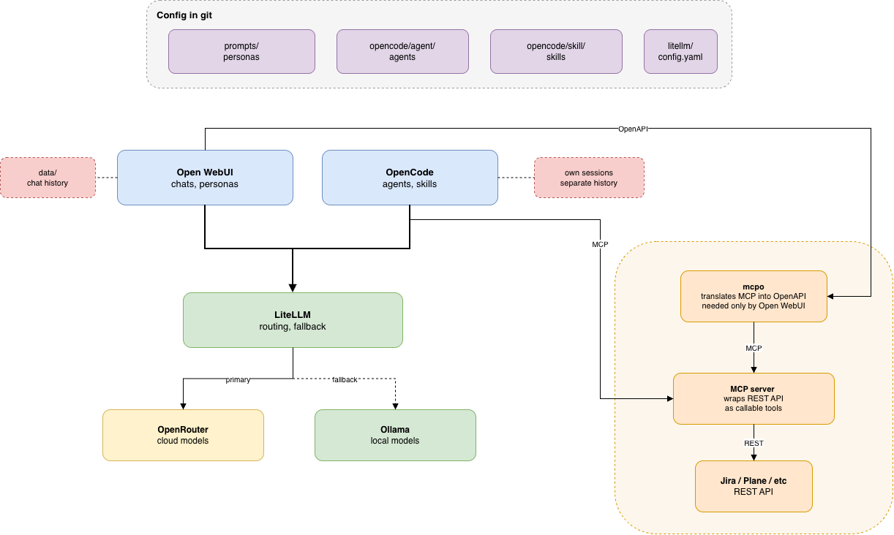

# ai-workspace

Local AI environment with swappable model providers.

## Overview

Two interfaces — Open WebUI for chats, OpenCode for agent tasks — talk to a shared LiteLLM gateway. The gateway routes requests to cloud or local models.

Switching providers means editing one YAML file. Interfaces stay untouched.

## Components

| Service | Port | Role |
|---|---|---|
| Open WebUI | 3000 | chats, personas |
| LiteLLM | 4000 | gateway, routing |
| mcpo | 8000 | MCP over OpenAPI |
| Ollama | 11434 | local inference, native |

Ollama runs outside Docker. Containers on macOS have no Metal access.

## Setup

```bash
git clone <repo> && cd ai-workspace
./bootstrap.sh
```

The script creates `.env` and exits. Fill in the keys, then run again:

```bash
./bootstrap.sh full
```

Profiles: `full` (48 GB), `light` (16–32 GB), `cloud` (no local models).

Then create an account in Open WebUI, get an API key from Settings → Account, add it to `.env`, and sync personas:

```bash
python3 scripts/sync-personas.py
```

## Layout

```
ai-workspace/
├── docker-compose.yml
├── bootstrap.sh
├── litellm/config.yaml      model aliases, fallback
├── prompts/                 Open WebUI personas
├── prompts.local/           personas, not in git
├── opencode/
│   ├── opencode.jsonc       provider, not in git
│   ├── agent/               agents
│   ├── skill/               skills
│   └── skill.local/         skills, not in git
├── mcpo/config.json         MCP servers
├── scripts/
│   ├── sync-personas.py
│   ├── backup.sh
│   └── restore.sh
└── data/                    Open WebUI database, not in git
```

## Model aliases

Personas and agents reference an alias, not a model:

```yaml
model_list:
  - model_name: qwen-coder-local
    litellm_params:
      model: ollama_chat/qwen3-coder:30b
      api_base: os.environ/OLLAMA_HOST_URL
```

Naming scheme: `model-role-location`. For example `qwen-coder-cloud-free`, `qwen-chat-local`.

Replacing the model behind an alias requires no changes to personas:

```bash
ollama pull qwen4:30b
# change model: in litellm/config.yaml
docker compose restart litellm
```

## Fallback

```yaml
router_settings:
  fallbacks:
    - laguna-coder-cloud-free: ["qwen-coder-cloud-free", "qwen-chat-local"]
    - qwen-coder-cloud-free: ["qwen-coder-local", "qwen-chat-local"]
```

Triggers on any provider error: exhausted rate limit, insufficient credits, revoked key, no network.

## Personas

A chat with a system prompt and a fixed model. File in `prompts/`:

```markdown
---
id: algo-coach
name: Coding Challenge Coach
base: qwen-coder-cloud-free
temperature: 0.3
---
System prompt.
```

Required fields: `id`, `name`, `base`.

```bash
python3 scripts/sync-personas.py           # add and update
python3 scripts/sync-personas.py --prune   # remove those missing from files
python3 scripts/sync-personas.py --dry-run # print payload only
```

Git is the source of truth. Edits made in the interface get overwritten.

## Agents and skills

OpenCode only.

**Agent** — system prompt, model, and tool permissions. File in `opencode/agent/`:

```markdown
---
description: Code review
mode: subagent
model: gateway/laguna-coder-cloud-free
tools:
  write: false
  edit: false
---
Instructions.
```

Modes: `primary` (selectable for a session), `subagent` (invoked via `@name`), `all`.

**Skill** — a procedure the model pulls in when the task matches its description. A folder in `opencode/skill/` containing `SKILL.md`:

```markdown
---
name: run-tests
description: Use when tests need to be run or a failure needs investigating
---
Instructions.
```

The model always sees `description`. The body loads only when the skill triggers.

Changes apply after restarting OpenCode.

## Public and private

| Path | In git |
|---|---|
| `prompts/`, `opencode/skill/` | yes |
| `prompts.local/`, `opencode/skill.local/` | no |
| `.env`, `data/` | no |

Config files reference environment variables, not values. The repository is publishable as is.

## Diagram


